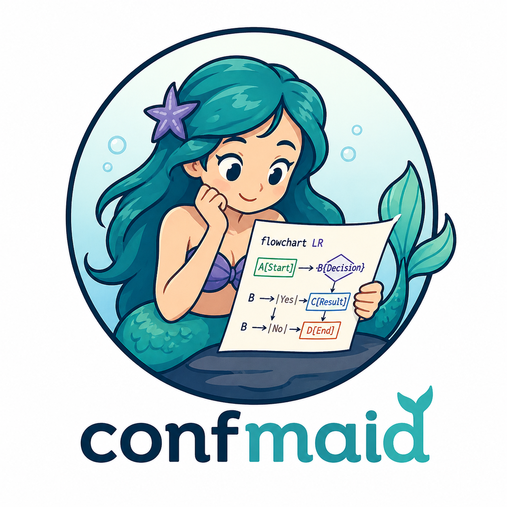

# Confmaid - Mermaid Diagrams for Confluence

# Note - this is a work in progress and is not ready for distribution or use. I'll publish a package once it's ready. You have been warned.

[](https://github.com/chris-gillatt/confmaid/actions/workflows/ci.yml)
[](https://github.com/chris-gillatt/confmaid/actions/workflows/dependency-check.yml)



Confmaid is a Confluence Cloud Forge app project for authoring and rendering Mermaid diagrams inside Confluence pages.

## Licence

This project is licensed under the MIT Licence. See `LICENSE`.

## Current Scope

- Platform: Confluence Cloud (Forge)
- MVP diagrams: flowchart, sequence, class
- Rendering strategy: hybrid direction, client-side-first MVP
- Security baseline: strict input validation and sanitisation gates

## Repository Structure

- `docs/problem-statement.md`: living product statement, requirements, and ADR log
- `src/lib/mermaidValidation.js`: Mermaid source validation utilities
- `src/lib/htmlSafety.js`: HTML escaping utility for untrusted source
- `src/lib/macroRenderer.js`: safe macro payload rendering helper
- `src/lib/macroConfig.js`: macro config normalisation and persistence contract helpers
- `src/resolverHandlers.js`: Forge operation handlers for macro lifecycle actions
- `src/index.js`: Forge resolver entrypoint with local test fallback
- `tests/mermaidValidation.test.js`: baseline unit tests for validator behaviour
- `static/main/index.html`: macro editor and preview scaffold UI
- `static/main/main.js`: Mermaid runtime load, resolver invocation, and local persistence fallback
- `static/main/invokeAdapter.mjs`: Forge bridge invoke adapter with local fallback
- `static/main/vendor/forge-bridge.js`: packaged Forge bridge invoke bundle for Custom UI runtime
- `tools/build-ui.mjs`: UI build script for vendor bridge packaging

## Contribution Policy

See `CONTRIBUTING.md` for commit conventions and the British English documentation standard.

## Implemented API Operations

The resolver currently supports these payload operations:

- `healthcheck`: basic connectivity response
- `validate`: validates Mermaid input and returns diagnostics
- `render`: validates then returns safe macro HTML payload with escaped source
- `loadMacroConfig`: returns normalised macro config for editor hydration
- `saveMacroConfig`: validates and returns persisted config plus rendered preview payload
- `renderFromMacroConfig`: renders using saved macro config source

`static/main/main.js` resolves invoke in this order:

1. `window.__CONFMAID_INVOKE__`
2. `window.__FORGE_BRIDGE_INVOKE__`
3. local fallback invoke for development and reopen-flow testing

## Local Development (Current)

This repository now contains a Forge-aligned resolver baseline with macro configuration load/save/render contracts and tests. UI-to-resolver invocation wiring is the next step.

### Environment Setup

Create your local environment file from the template:

```bash
cp .env.local.example .env.local
```

Then fill in real values for Confluence credentials and base URL.

### Prerequisites

- Podman (recommended)
- Atlassian Forge CLI

## Container-First Development (Recommended)

Using Podman keeps the host clean and gives a reproducible Node/npm environment for the project.

Container build context ignores are managed in `.containerignore`, including `.env.local` so local secrets are not sent to the container build context.

On macOS, initialise and start the Podman VM once:

```bash
podman machine init
podman machine start
```

### 1) Build the development image

```bash
podman build -f Containerfile.dev -t confmaid-dev:node24 .
```

### 2) Start a shell in the project container

```bash
podman run --rm -it \
	-v "$PWD":/workspace:Z \
	-w /workspace \
	confmaid-dev:node24
```

### 3) Run tests in the container

```bash
npm test
```

### 4) Build packaged UI bridge assets

```bash
npm install
npm run build:ui
```

### Forge CLI in container

Inside the running container:

```bash
npm install -g @forge/cli
forge --version
forge login
forge register
```

After `forge register`, replace the app id placeholder in `manifest.yml`.

## Optional Host Install (If You Prefer)

If you do not want to use Podman, install Node and npm directly on macOS:

```bash
brew install node@24
echo 'export PATH="/opt/homebrew/opt/node@24/bin:$PATH"' >> ~/.zshrc
source ~/.zshrc
node --version
npm --version
```

Install Forge CLI once Node/npm are available:

```bash
npm install -g @forge/cli
forge --version
```

### Run tests

```bash
node --test
```

### Lint and format checks

```bash
npm run lint
npm run format:check
```

The suite now includes a resolver contract integration-style lifecycle test (`tests/macroLifecycle.integration.test.js`) for insert/save/reopen/edit/render flows.

### Forge bootstrap (next runnable step)

```bash
forge login
forge register
```

## Dependency Automation

Dependabot is enabled via `.github/dependabot.yml` for weekly npm and GitHub Actions update pull requests.

### Manual npm dependency maintenance

Check outdated packages:

```bash
npm run deps:check
```

Update package.json ranges to latest versions and refresh the lockfile:

```bash
npm run deps:update
```

Then validate the project:

```bash
npm run lint
npm test
```

Container-first equivalent:

```bash
podman run --rm -v "$PWD":/workspace:Z -w /workspace confmaid-dev:node24 npm run deps:check
podman run --rm -v "$PWD":/workspace:Z -w /workspace confmaid-dev:node24 npm run deps:update
podman run --rm -v "$PWD":/workspace:Z -w /workspace confmaid-dev:node24 npm run lint
podman run --rm -v "$PWD":/workspace:Z -w /workspace confmaid-dev:node24 npm test
```

## Installing on Your Confluence Site

Forge apps are installed per-site and per-environment (development or production). There is no platform-provided package download or drag-and-drop install path — installation always requires either the Forge CLI or the Atlassian Developer Console sharing flow described below.

### Option A — CLI install (for the app owner/developer)

This is the standard path if you are the person who registered and deployed the app.

```bash
forge install --site <your-site>.atlassian.net --product Confluence --environment production
```

To upgrade an existing install after deploying a new version:

```bash
forge install --upgrade --site <your-site>.atlassian.net --product Confluence --environment production
```

### Option B — Installation link (for sharing without CLI access)

Use this path to let a Confluence site admin install the app without needing the Forge CLI.

**Steps for the app owner (one-time setup):**

1. Deploy the app to the production environment:
   ```bash
   forge deploy --environment production
   ```
2. Open the [Forge Developer Console](https://developer.atlassian.com/console/myapps/) and select this app.
3. In the left menu, select **Distribution** → **Edit** under Distribution controls.
4. Select the **Sharing** option, fill in the app details, and save.
5. Copy the generated **installation link**.
6. Send the link to the Confluence site admin.

**Steps for the site admin (installs the app):**

1. Visit the installation link provided by the app owner.
2. An Atlassian-hosted install screen appears showing the app name and requested permissions.
3. Select your Confluence site from the dropdown.
4. Click **Install** — no developer account or CLI needed.

> **Note:** The site admin must have Confluence admin permissions on the target site. The installation link can be revoked at any time from the Developer Console.

## Next Implementation Steps

1. Deploy and install Forge app on the HOME space test site.
2. Persist macro configuration via Confluence macro edit/save cycle and reload flow.
3. Run end-to-end integration tests against the live Forge/Confluence environment.
4. Add security and performance test suites.
